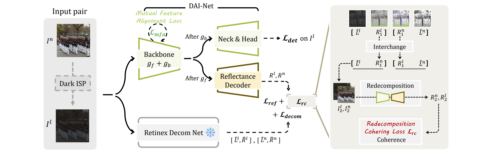

<p align="center">
  <h1 align="center">Boosting Object Detection with Zero-Shot Day-Night Domain Adaptation
</h1>
  <p align="center">
    <a href="https://zpdu.github.io/">Zhipeng Du</a>
    ·
    <a href="https://sites.google.com/site/miaojingshi/home">Miaojing Shi</a>
    ·
    <a href="https://jiankangdeng.github.io/">Jiankang Deng</a>
  </p>

PyTorch implementation of **Boosting Object Detection with Zero-Shot Day-Night Domain Adaptation**. (To appear in **CVPR 2024**) [[arXiv](https://arxiv.org/abs/2312.01220)]




## 🔨 To-Do List

1. - [x] release the code regarding the proposed model and losses.
3. - [x] release the evaluation code, and the pretrained models.

3. - [ ] release the training code.

## :notebook: Evaluation​

On Dark Face:

- Download the testing samples from [UG2+ Challenge](https://competitions.codalab.org/competitions/32499).
- Download the checkpoints: [DarkFaceZSDA](https://drive.google.com/file/d/1BdkYLGo7PExJEMFEjh28OeLP4U1Zyx30/view?usp=drive_link) (28.0) or [DarkFaceFS](https://drive.google.com/file/d/1ykiyAaZPl-mQDg_lAclDktAJVi-WqQaC/view?usp=drive_link) (52.9, finetuned with full supervision).
- Set (1) the paths of testing samples & checkpoint, (2) whether to use a multi-scale strategy, and run test.py.
- Submit the results for benchmarking. ([Detailed instructions](https://competitions.codalab.org/competitions/32499)).

On ExDark:

- Our experiments are based on the codebase of [MAET](https://github.com/cuiziteng/ICCV_MAET). You only need to replace the checkpoint with [ours](https://drive.google.com/file/d/1g74-aRdQP0kkUe4OXnRZCHKqNgQILA6r/view?usp=drive_link) for evaluation.

## 📑 Citation

If you find this work useful, please cite

``` citation
@article{du2023boosting,
  title={Boosting Object Detection with Zero-Shot Day-Night Domain Adaptation},
  author={Du, Zhipeng and Shi, Miaojing and Deng, Jiankang},
  journal={arXiv preprint arXiv:2312.01220},
  year={2023}
}
```


## 🔎 Acknowledgement

We thank [DSFD.pytorch](https://github.com/yxlijun/DSFD.pytorch), [RetinexNet_PyTorch](https://github.com/aasharma90/RetinexNet_PyTorch), [MAET]([MAET](https://github.com/cuiziteng/ICCV_MAET)), [HLA-Face](https://github.com/daooshee/HLA-Face-Code) for their amazing works!

